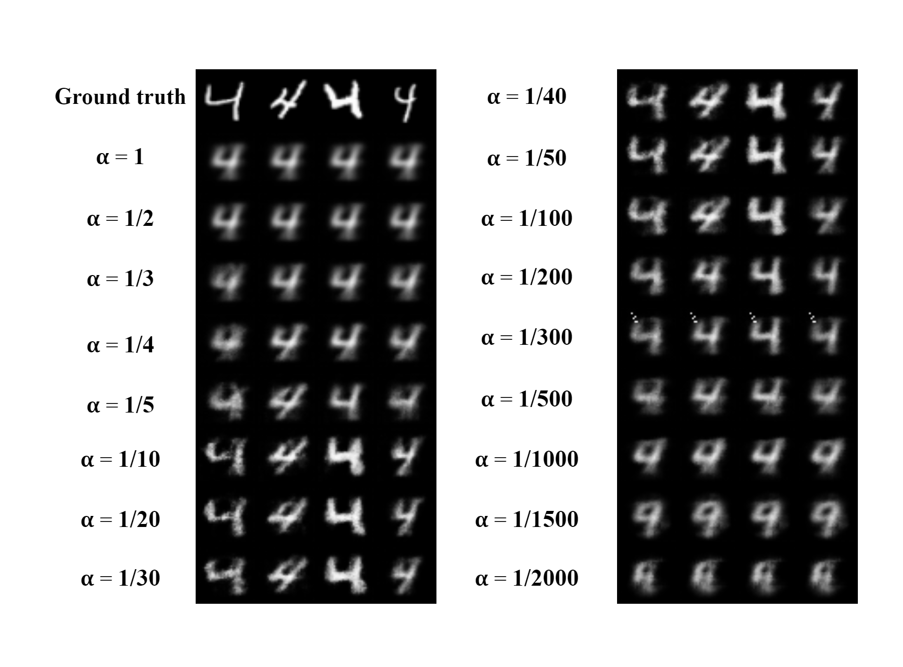
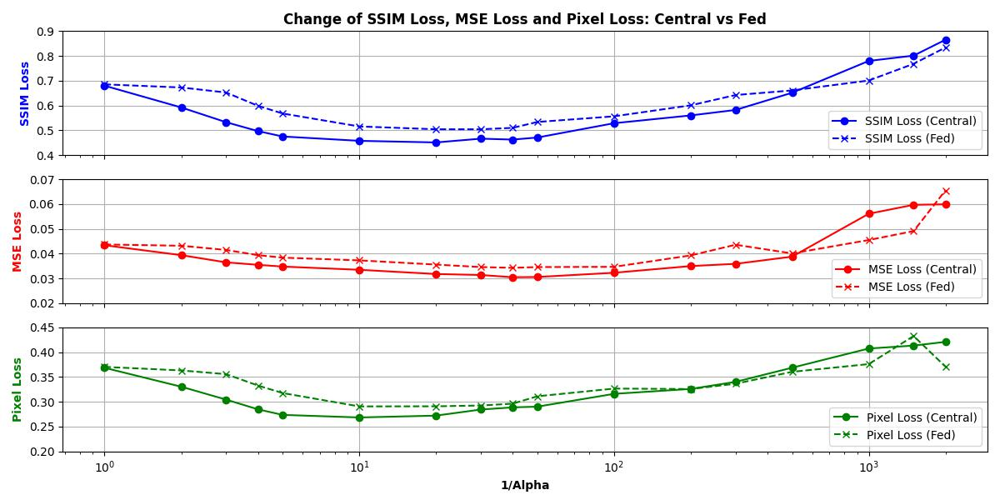

# Model-Inversion-Attacks
Model Inversion Attacks Research Project
## Architecture Overview of the AGIA

## Abstract
Federated Learning (FL) facilitates collaborative model training while safeguarding data privacy, making it ideal for sensitive fields such as finance, education, and healthcare. Despite its promise, FL remains vulnerable to privacy breaches, particularly through gradient inversion attacks that can reconstruct private data from shared model updates. This research introduces a nonlinear amplification strategy that enhances the potency of such attacks, revealing heightened risks of data leakage in FL environments. Additionally, we evaluate the resilience of privacy-preserving mechanisms, such as Differential Privacy (DP) and Homomorphic Encryption (HE), by employing two proposed metrics AvgSSIM and AvgMSE to measure both the severity of attacks and the efficacy of defenses.
## Usage
### Hardware Requirements
Any Nvidia GPU with 8GB or larger memory is ok. The experiments were initially performed on a NVIDIA Tesla P40 24GB GDDR5.
### Required Runtime Libraries
* [Anaconda](https://www.anaconda.com/download/)
* [Pytorch](https://pytorch.org/) -- `conda install pytorch torchvision torchaudio pytorch-cuda=11.8 -c pytorch -c nvidia`
* [zhangzp9970/torchplus](https://github.com/zhangzp9970/torchplus) -- `conda install torchplus -c zhangzp9970`
### Datasets
* MNIST -- `torchvision.datasets.MNIST`
* Fashion-MNIST -- `torchvision.datasets.FashionMNIST`
### File Description
* main_Fl.py -- Training the Target Network (classification) using Federated Learning
* main_central.py -- Training the Target Network (classification) using Central
* attack_fed.py -- Attacking the target network trained using Federated Learning
* attack_central_tc1.py -- The impact of attacking the target network trained using FL and Central approaches.
* attack_central_tc2.py -- Comparison of inversion outcomes with different alpha values
* attack_central.py -- Attacking the target network trained using Central
* plot_img_tc2_label4.py -- The impact of the amplification layer's alpha parameter on the evaluation metrics
* requirement.txt -- Necessary auxiliary libraries
* script_run_file.txt -- Script the commands to run the files according to each test case
### Example Results
#### The impact of attacking the target network trained using FL and Central approaches.
* The impact of attacking the target network with MNIST dataset by each epoch 
* Reconstruction results of AGIA on MNIST and Fashion-MNIST dataset. 

#### Comparison of inversion outcomes with different alpha values.
#### The impact of the amplification layer's alpha parameter on the evaluation metrics 
#### Attacking Fashion-MNIST non-iid trained using FL 
